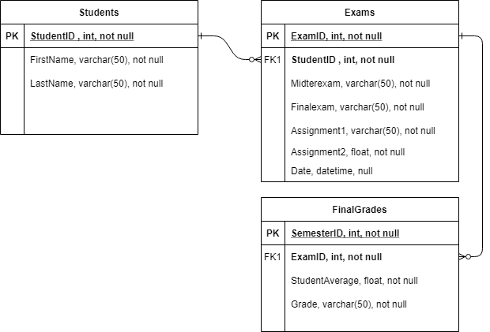
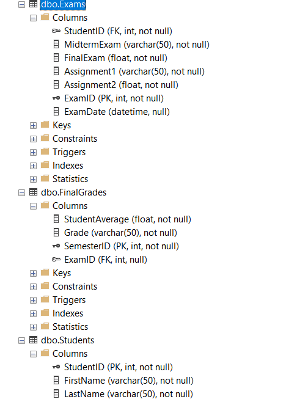

# Final-Project_SQL
The final project of MTA Database Fundamentals course.
## The Objective
*	Use “Grade Record” dataset (either use the entire dataset or the first 50 record).
*	Create a master table that will hold your entire dataset.
*	Normalize the dataset into third normal form.
*	Identify primary and foreign keys for your tables.
*	Use JOIN to create a consolidated table.
*	Present your code to class.
## Implementation
* Conceptual Design (ERD)
the Master table was broken down into 3 tables: Students, Exams, Final Grades to comply with 2NF and 3NF

* Relational Model

